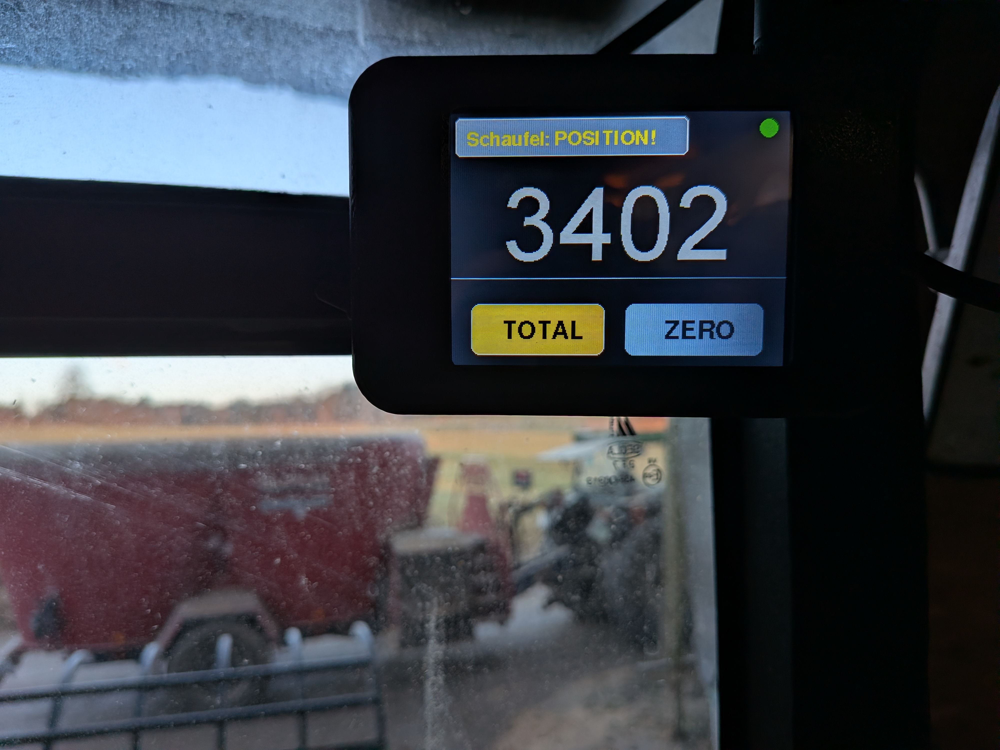
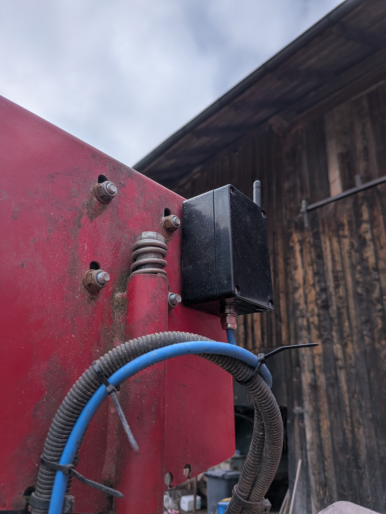
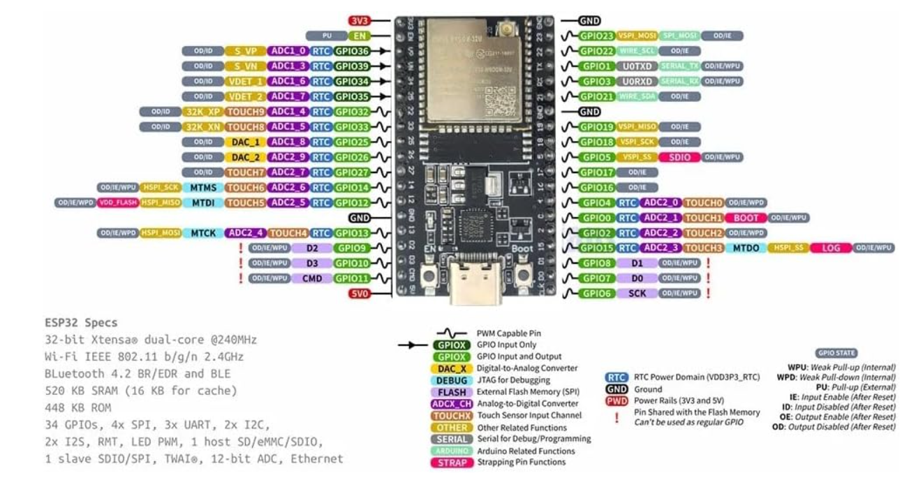
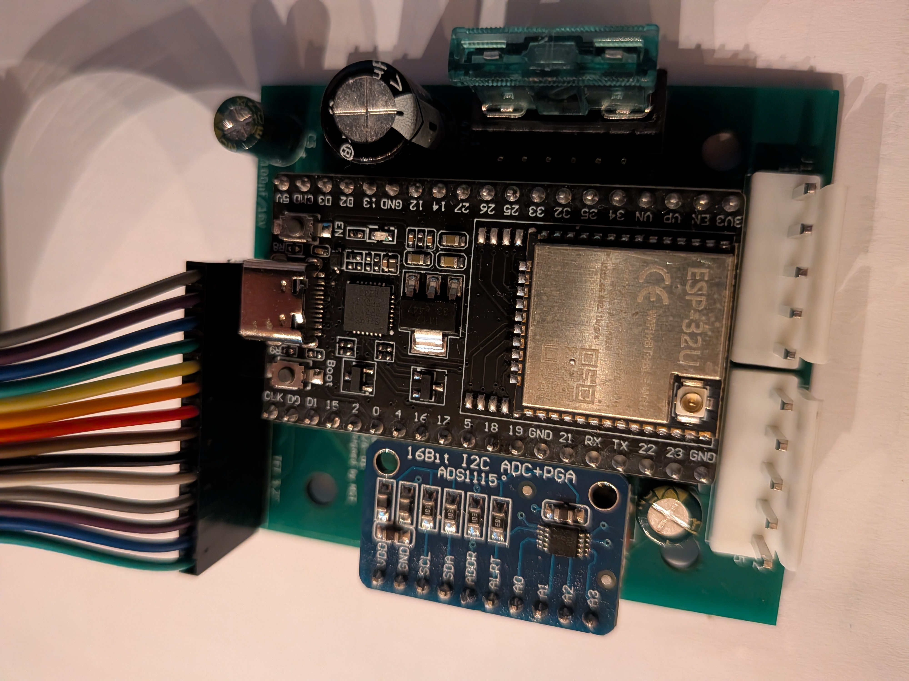
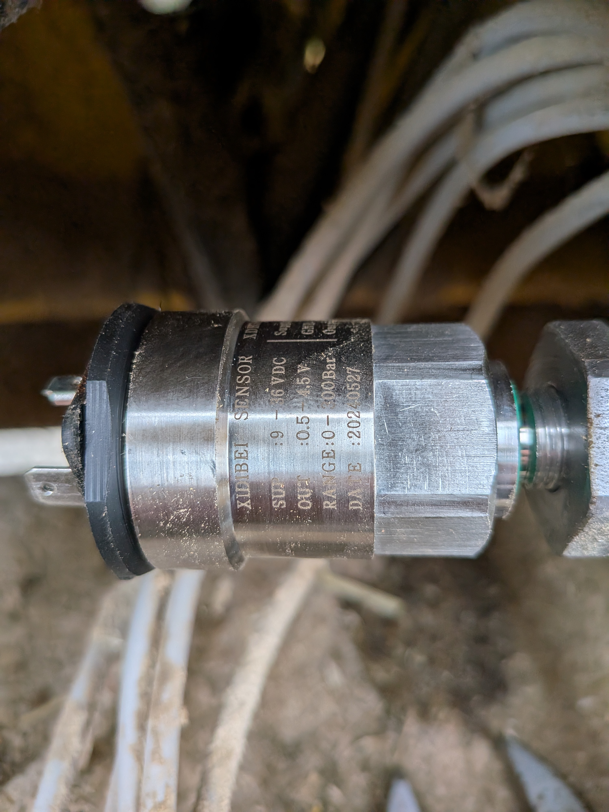
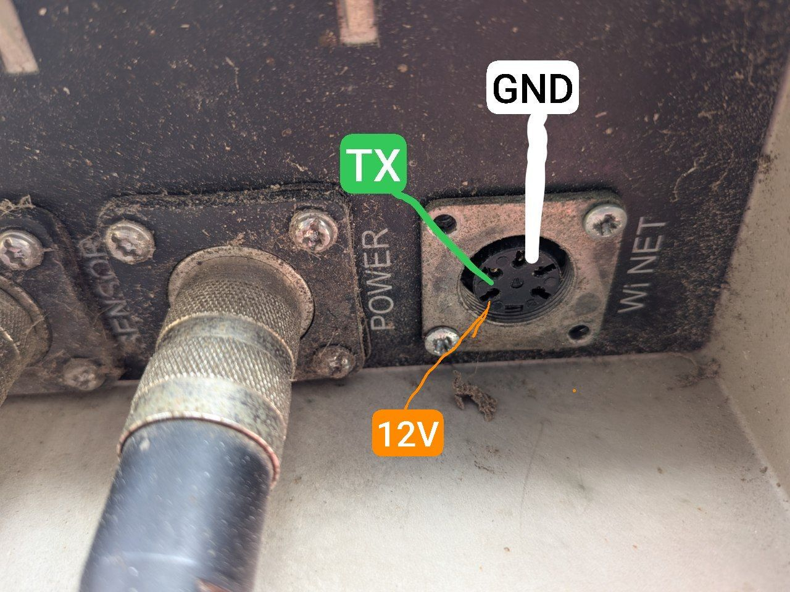
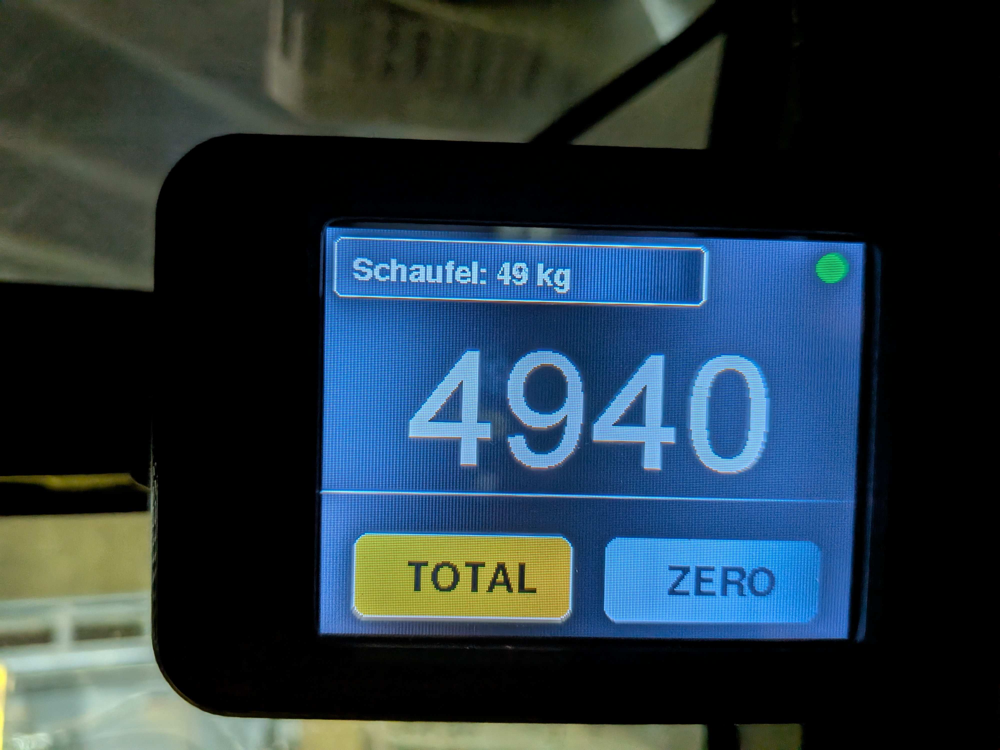
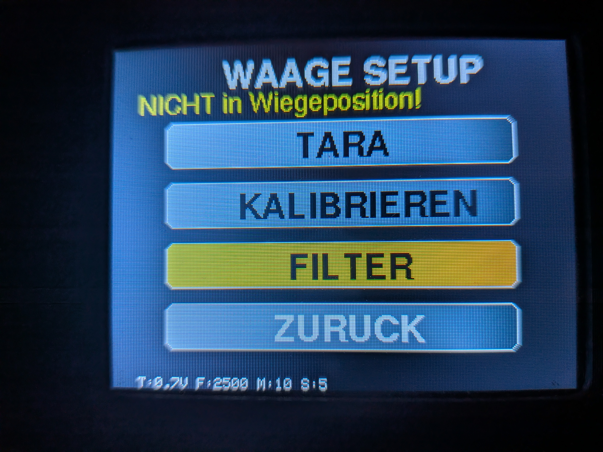
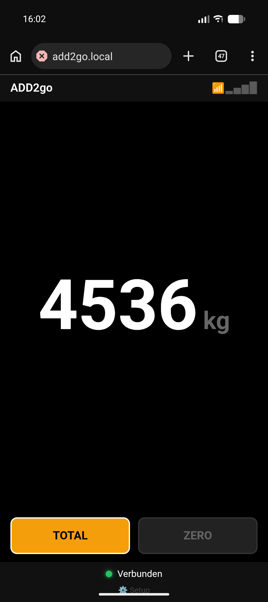

# ADD2go

**Wireless Fernanzeige für Dinamica Generale ADD2 / Siloking Mischwagen**

Überträgt Gewichtsdaten kabellos von der Mischwagen-Waage zum Radlader-Display oder Smartphone.

ADD2go ist in erster Linie eine **Fernanzeige** für die ADD2 Waage. Zusätzlich integriert ist eine **Schaufel-Wiegung** mit Drucksensor — fand ich nützlich, daher ist sie mit reingewandert.


*ADD2go — kabellose Fernanzeige für die ADD2-Waage*


---

## 📋 Übersicht

ADD2go besteht aus zwei ESP32-Modulen und einer optionalen WebApp:

| Modul | Standort | Funktion |
|-------|----------|----------|
| **Sender** | Mischwagen | Liest RS232 von ADD2 Waage, sendet per WiFi |
| **Empfänger** | Radlader | Zeigt Gewicht auf TFT-Display an |
| **WebApp** | Smartphone | Gewicht im Browser anzeigen |

> 💡 **Hinweis zur Hardware:** Sender und Empfänger nutzen **dieselbe Platine** — sie wird je nach Anwendung unterschiedlich bestückt (Sender: MAX3232 + WI-NET; Empfänger: zusätzlich TFT-Header, ADS1115-Header, K7812M für Drucksensor). Details siehe [`add2go_pcb/README.md`](add2go_pcb/README.md).

### Features

**Sender:**
- ✅ RS232 Auswertung des ADD2 Protokolls
- ✅ WiFi Access Point ("ADD2go")
- ✅ WiFi-Manager - zusätzlich mit Heimnetz verbinden
- ✅ mDNS - erreichbar unter `http://add2go.local`
- ✅ UDP Broadcast für Hardware-Empfänger
- ✅ WebSocket Server für WebApp
- ✅ Eingebaute WebApp mit TOTAL/ZERO Funktion
- ✅ "OFF" Erkennung wenn Waage ausgeschaltet
- ✅ Hardware Watchdog (kein Aufhängen)

**Empfänger:**
- ✅ Echtzeit-Gewichtsanzeige
- ✅ TOTAL/ZERO Funktion (Auto-Reset bei Verbindungsverlust)
- ✅ Schaufel-Wiegung mit Drucksensor (optional)
- ✅ Filter für stabile Anzeige (Mittelwert + Hysterese)
- ✅ ADS1115-Watchdog (Sensor-Ausfall wird erkannt)
- ✅ Auto-Reconnect bei WiFi-Verlust
- ✅ Hardware Watchdog

---

## 🌐 WiFi-Manager

Der Sender kann sich zusätzlich mit einem externen WLAN (z.B. Hof-WLAN) verbinden. Dadurch muss das Handy nicht mehr ins "ADD2go" WLAN wechseln.

### Einrichtung

1. Handy mit WLAN **"ADD2go"** verbinden
2. Browser öffnen: `http://192.168.4.1/setup`
3. Verfügbare Netzwerke werden angezeigt
4. Netzwerk auswählen, Passwort eingeben
5. Nach erfolgreicher Verbindung: erreichbar unter `http://add2go.local`

### Betriebsmodi

| Modus | Beschreibung |
|-------|--------------|
| **Nur AP** | Standard - Sender erstellt eigenes WLAN "ADD2go" |
| **AP + Station** | Sender ist zusätzlich mit Heimnetz verbunden |

### Vorteile der Heimnetz-Verbindung

- Kein WLAN-Wechsel mehr nötig am Handy
- Erreichbar unter `http://add2go.local` (mDNS)
- WLAN-Daten werden gespeichert (überlebt Neustart)
- Auto-Reconnect wenn Mischwagen zurückkommt
- AP "ADD2go" bleibt zusätzlich aktiv (Fallback)

---

## 🔧 Hardware

### Sender (Mischwagen)


*Sender-Modul: ESP32, MAX3232 (RS232) und 7805-Spannungsregler*

| Komponente | Typ | Bemerkung |
|------------|-----|-----------|
| Mikrocontroller | [ESP32-WROOM-32U](https://www.amazon.de/dp/B0F65KPWYR) | Mit U.FL Antennenanschluss |
| Antenne | 2.4GHz extern | Im ESP32-Set enthalten |
| RS232 Wandler | MAX3232CPE | DIP-16, 5x 1µF Kondensatoren |
| Spannungsregler | K7805M | 12V → 5V Schaltregler (pin-kompatibel zu 7805, kein Kühlkörper nötig) |
| Verpolschutz | 1N5822 | Schottky-Diode |
| Überspannungsschutz | 1.5KE18A | TVS-Diode 18V |
| WI-NET Stecker | Binder M16 5-pol | Bestellnr. 09 0313 00 05 |
| Gehäuse | [Industrie-Gehäuse 100×68×50 mm](https://de.aliexpress.com/item/1005005622148025.html) | gekauft (kein 3D-Druck nötig) |
| Platine | Custom KiCad-Projekt | Schaltplan, Layout, Fertigung — siehe [`add2go_pcb/README.md`](add2go_pcb/README.md) |

**Pinbelegung Sender:**

| ESP32 Pin | Funktion |
|-----------|----------|
| GPIO16 | RX2 ← MAX3232 (Daten von Waage) |
| GPIO17 | TX2 → MAX3232 (nicht verwendet) |
| 5V | Versorgung vom Spannungsregler |
| GND | Gemeinsame Masse |


*ESP32-WROOM-32 Pinbelegung (Referenz)*

### Empfänger (Radlader)


*Empfänger-Modul: ESP32, ILI9341 Display mit Touch und ADS1115 ADC*

| Komponente | Typ | Bemerkung |
|------------|-----|-----------|
| Mikrocontroller | [ESP32-WROOM-32U](https://www.amazon.de/dp/B0F65KPWYR) | Mit U.FL Antennenanschluss |
| Antenne | 2.4GHz extern | Im ESP32-Set enthalten |
| Display | [ILI9341 3.2" TFT](https://de.aliexpress.com/item/1005003005216533.html) | 320x240, SPI, mit Touch |
| Touch | XPT2046 | Resistiv, im Display integriert |
| ADC | ADS1115 | 16-bit, I²C (für Schaufel-Wiegung) |
| Drucksensor | [XIDIBEI 0-300 bar](https://de.aliexpress.com/item/4001002862246.html) | 9-36V Versorgung, 0.5-4.5V Ausgang (für Schaufel-Wiegung, optional) |
| Reed-Kontakt | Digital | Wiegeposition erkennen (optional) |
| Spannungsregler 5 V | K7805M | 12 V → 5 V Schaltregler (für ESP32) |
| Spannungsregler 12 V | K7812M | stabilisierte 12 V (für Drucksensor) |
| Gehäuse | 3D-gedruckt | STL-Dateien, Schalter, Kabelverschraubung — siehe [`case/README.md`](case/README.md) |
| Platine | Custom KiCad-Projekt | Schaltplan, Layout, Fertigung — siehe [`add2go_pcb/README.md`](add2go_pcb/README.md) |

**Pinbelegung Empfänger:**

| ESP32 Pin | Funktion |
|-----------|----------|
| GPIO5 | Display CS |
| GPIO2 | Display RST |
| GPIO4 | Display DC |
| GPIO23 | SPI MOSI |
| GPIO18 | SPI SCK |
| GPIO19 | SPI MISO |
| GPIO15 | Touch CS |
| GPIO14 | Touch IRQ |
| GPIO21 | I²C SDA (ADS1115) |
| GPIO22 | I²C SCL (ADS1115) |
| GPIO36 | Reed-Kontakt (LOW = Wiegeposition) |


*XIDIBEI Drucksensor (0–300 bar, 9–36 V → 0,5–4,5 V) — Quelle für die Schaufel-Wiegung*

### WI-NET Stecker (ADD2 Waage)

Der WI-NET Anschluss ist ein 5-poliger M16 Stecker an der ADD2 Waage.

**Passender Kabelstecker:** [Binder Serie 680, M16, 5-polig](https://www.binder-connector.de/de/produkte/rundsteckverbinder/m16-ip40-serie-680/kabelstecker-09-0313-00-05)
- Bestellnummer: **09 0313 00 05**
- Lötkontakte, 3.0-6.0mm Kabeldurchlass

> 💡 **Hinweis:** Bei diesem Stecker bin ich mir nicht 100% sicher — er passt nicht ganz exakt in die Buchse, funktioniert aber zuverlässig.

Die Pinbelegung wurde durch eigene Messungen ermittelt:

| Pin | Position | Funktion | Verbindung |
|-----|----------|----------|------------|
| 1 | unten | +12V | → Spannungsregler VIN |
| 2 | rechts oben | GND | → Gemeinsame Masse |
| 3 | oben mitte | TX | → MAX3232 R1IN (Pin 13) |
| 4 | links oben | - | nicht belegt |
| 5 | links unten | - | nicht belegt |


*WI-NET Stecker (Binder M16, 5-polig) — eigene Messung der Pinbelegung*

> ⚠️ **Wichtig:** Pinbelegung von vorne auf die Buchse (an der Waage) gesehen!

---

## 📡 Kommunikation

### WiFi Konfiguration

| Parameter | Wert |
|-----------|------|
| AP SSID | `ADD2go` |
| AP Passwort | keins (offen) |
| AP IP | `192.168.4.1` |
| AP Subnetz | `255.255.255.0` |
| mDNS Hostname | `add2go.local` |
| WiFi Modus | APSTA (AP + Station gleichzeitig) |

### Netzwerk-Protokolle

| Protokoll | Port | Richtung | Verwendung |
|-----------|------|----------|------------|
| UDP Broadcast | 5005 | Sender → Empfänger | Hardware-Display |
| WebSocket | 81 | Sender ↔ Browser | WebApp (bidirektional) |
| HTTP | 80 | Browser → Sender | WebApp + Setup-Seite |

### UDP Protokoll (für Hardware-Empfänger)

Der Sender sendet alle 100ms (10 Hz) einen UDP-Broadcast:

| Parameter | Wert |
|-----------|------|
| Ziel-IP | `192.168.4.255` (Broadcast) |
| Port | `5005` |
| Format | ASCII String |

**Nachrichten:**

| Nachricht | Bedeutung |
|-----------|-----------|
| `1234` | Gewicht in kg (ohne Einheit) |
| `OFF` | Waage ist ausgeschaltet |

### WebSocket Protokoll (für WebApp)

Der Sender sendet alle 100ms (10 Hz) an alle verbundenen WebSocket-Clients:

| Parameter | Wert |
|-----------|------|
| Port | `81` |
| Format | `Gewicht\|RSSI` |

**Beispiele:**

| Nachricht | Bedeutung |
|-----------|-----------|
| `1234\|-65` | 1234 kg, Signalstärke -65 dBm |
| `OFF\|-70` | Waage aus, Signalstärke -70 dBm |

---

## 📟 RS232 Protokoll (ADD2 Waage)

Das RS232 Protokoll wurde durch eigenes Reverse-Engineering ermittelt.

### Schnittstellenparameter

| Parameter | Wert |
|-----------|------|
| Baudrate | 19200 |
| Datenbits | 8 |
| Parität | Keine |
| Stoppbits | 1 |
| Updaterate | ~1.3 Hz (alle ~770ms) |

### Frame-Struktur

Die Waage sendet kontinuierlich Frames mit folgendem Aufbau:

```
[Präambel] [Start] [Type] [Seq] [Header] [Gewicht ASCII] [Ende]
    16       0x23   0x03   xx    0x18 0x00    "  1234"     0x0A
```

| Feld | Bytes | Wert | Beschreibung |
|------|-------|------|--------------|
| Präambel | 16 | variabel | Sync-Bytes (werden ignoriert) |
| Start | 1 | `0x23` | Start-Marker (`#`) |
| Type | 1 | `0x03` | Frame-Typ (ETX) |
| Sequence | 1 | `0x00-0xFF` | Laufender Zähler |
| Header | 2 | `0x18 0x00` | Fester Header |
| Gewicht | variabel | ASCII | Rechtsbündig mit Leerzeichen |
| Ende | 1 | `0x0A` | Line Feed (LF) |

### Beispiel-Frame

```
Hex:  23 03 7B 18 00 20 20 20 20 32 0A
      │  │  │  │  │  └──────────┴──┴── "    2" + LF = 2 kg
      │  │  │  └──┴── Header 0x18 0x00
      │  │  └── Sequence 0x7B (123)
      │  └── Type 0x03
      └── Start 0x23
```

### Gewichtswerte

| Anzeige Waage | RS232 Daten | Bedeutung |
|---------------|-------------|-----------|
| `2` | `20 20 20 20 32` | 2 kg |
| `123` | `20 20 31 32 33` | 123 kg |
| `1234` | `20 31 32 33 34` | 1234 kg |
| (aus) | keine Daten | Waage ausgeschaltet |

### OFF-Erkennung

Wenn 3 Sekunden lang keine gültigen RS232-Daten empfangen werden, gilt die Waage als ausgeschaltet. Der Sender sendet dann `"OFF"` über UDP und WebSocket.

---

## 💾 Installation

### Voraussetzungen

- Arduino IDE 1.8.19
- ESP32 Board Package (v3.x empfohlen)
- USB-Treiber für ESP32 (CP2102 oder CH340)

### Benötigte Libraries

**Sender:**
- WebSockets by Markus Sattler (Library Manager: "WebSockets")

**Empfänger:**
- TFT_eSPI by Bodmer
- XPT2046_Touchscreen by Paul Stoffregen
- Adafruit ADS1X15 by Adafruit

### TFT_eSPI Konfiguration

Die TFT_eSPI Library muss für das ILI9341 Display konfiguriert werden.

> ⚠️ **Wichtig:** Die TFT_eSPI Library hat eine **globale** Konfigurationsdatei (`User_Setup.h`). Diese wird von ALLEN Projekten geteilt, die TFT_eSPI verwenden! Wenn du an einem anderen Projekt arbeitest und die Pins änderst, läuft ADD2go nicht mehr — `tft.init()` hängt dann beim Boot ohne Fehlermeldung. **Daher: vor jedem Flashen prüfen, dass `User_Setup.h` zu ADD2go passt.**

**Datei:** `Arduino/libraries/TFT_eSPI/User_Setup.h`

```cpp
// Display-Treiber
#define ILI9341_DRIVER

// Display-Größe
#define TFT_WIDTH  240
#define TFT_HEIGHT 320

// Pin-Definitionen
#define TFT_CS   5
#define TFT_DC   4
#define TFT_RST  2
#define TFT_MOSI 23
#define TFT_SCLK 18
#define TFT_MISO 19

// SPI-Geschwindigkeit
#define SPI_FREQUENCY 40000000

// Touch
#define TOUCH_CS 15
```

### Flashen

**Sender:**
```
Board:     ESP32 Dev Module
Datei:     add2go_sender_v1_2_4/add2go_sender_v1_2_4.ino
Baudrate:  115200
```

**Empfänger:**
```
Board:     ESP32 Dev Module
Datei:     add2go_empfaenger_v1_0_2/add2go_empfaenger_v1_0_2.ino
Baudrate:  115200
```

---

## 🖥️ Bedienung

### Hardware-Display (Empfänger)


*Hauptansicht mit Gewichtszahl und TOTAL/ZERO-Buttons*

**Anzeigen:**

| Anzeige | Farbe | Bedeutung |
|---------|-------|-----------|
| Gewicht | Weiß | Normale Anzeige |
| `OFF` | Rot | Waage ausgeschaltet |
| `OFFLINE` | Rot | Keine WiFi-Verbindung zum Sender |
| `SUCHE..` | Orange | WiFi wird gesucht |
| `- - - -` | Grau | Verbunden, warte auf Daten |

**Buttons:**

| Button | Funktion |
|--------|----------|
| **TOTAL** | Zeigt Gesamt-Gewicht von Waage |
| **ZERO** | Setzt aktuelles Gewicht als Null (Differenz-Messung) |
| **Schaufel** | Öffnet Schaufel-Wiegung Menü |

> 💡 **Hinweis:** ZERO wird automatisch zurückgesetzt wenn die Verbindung zum Sender verloren geht oder die Waage auf OFF wechselt. So gibt es nach Wiedereinschalten keinen falschen Offset.

**Schaufel-Wiegung Menü:**


*Setup-Menü für die Schaufel-Wiegung*

| Menüpunkt | Funktion |
|-----------|----------|
| TARA | Setzt leere Schaufel als Nullpunkt |
| KALIBRIEREN | Bekanntes Gewicht eingeben zur Kalibrierung |
| FILTER | Mittelwert-Anzahl (5-30) und Hysterese-Schwelle (1-10 kg) |
| ZURÜCK | Zurück zur Hauptansicht |

> 💡 **Hinweis:** Bei TARA und Kalibrierung wird der Filter-Buffer automatisch geleert, damit die Anzeige sofort die neuen Werte zeigt.

**Sensor-Ausfall:** Wenn der ADS1115 nicht antwortet (z.B. Kabelbruch, Wackelkontakt), zeigt der Schaufel-Button `SENSOR-FEHLER` in rot an. TARA und KALIBRIEREN sind dann gesperrt.

---

## 📱 WebApp

Der Sender bietet eine eingebaute WebApp - das Gewicht direkt auf dem Smartphone anzeigen. Sie funktioniert parallel zum Hardware-Empfänger und ist als Nebenfunktion gedacht.

<p align="center">
  
  <br>
  <em>WebApp im Browser am Smartphone</em>
</p>

### Zugriff

| Methode | URL | Wann nutzen |
|---------|-----|-------------|
| Direkt | `http://192.168.4.1` | Handy mit "ADD2go" WLAN verbunden |
| Heimnetz | `http://add2go.local` | Handy im Hof-WLAN (nach Setup) |
| Heimnetz | `http://[IP-Adresse]` | Falls mDNS nicht funktioniert |

### Funktionen

| Element | Beschreibung |
|---------|--------------|
| **Gewichtsanzeige** | Groß und zentral, mit "kg" Einheit |
| **TOTAL** | Zeigt Gesamtgewicht von der Waage |
| **ZERO** | Speichert aktuelles Gewicht, zeigt Differenz |
| **Signalstärke** | 📶▂▄▆█ (4 Stufen) |
| **Status** | 🟢 Verbunden / 🟠 Waage aus / 🔴 Offline |

### TOTAL / ZERO Funktion

- **TOTAL**: Normaler Modus - zeigt das Gewicht wie es von der Waage kommt
- **ZERO**: Drücken um aktuelles Gewicht als Nullpunkt zu setzen. Danach wird die Differenz angezeigt. Praktisch zum Wiegen von Zuladungen.

Der aktive Modus ist **orange** markiert. Diese Funktion läuft lokal in der WebApp und beeinflusst nicht die ADD2 Waage selbst.

---

## 🔍 Troubleshooting

### Häufige Probleme

| Problem | Ursache | Lösung |
|---------|---------|--------|
| Boot-Loop, hängt bei `tft.init()` | Falsches `User_Setup.h` (z.B. von anderem Projekt überschrieben) | `User_Setup.h` der TFT_eSPI Library prüfen, Pins müssen zu ADD2go passen |
| Display zeigt `OFFLINE` | Kein WiFi zum Sender | Sender einschalten, Nähe prüfen, Antennen prüfen |
| Display zeigt `OFF` | Waage ausgeschaltet | ADD2 Waage einschalten |
| Display zeigt `- - - -` | WiFi ok, aber keine Daten | RS232 Verkabelung prüfen |
| Schaufel: `SENSOR-FEHLER` | ADS1115 antwortet nicht | I²C Verkabelung prüfen, Neustart |
| WebApp zeigt `---` | WebSocket nicht verbunden | Seite neu laden, WLAN prüfen |
| WebApp Buttons grau | Keine Verbindung | Warten oder Seite neu laden |
| `add2go.local` geht nicht | mDNS Problem | IP-Adresse direkt verwenden |
| WLAN-Daten nicht gespeichert | NVS Fehler | Serial Monitor prüfen |
| Sender startet neu | Watchdog | Serial Monitor auf Fehler prüfen |

### Serial Monitor Debug

Baudrate: **115200**

**Sender Startup (normal):**
```
========================================
ADD2go Sender - v1.2.4
========================================

[NVS] Lade gespeicherte Daten...
[NVS] SSID: MeinHofWLAN
[NVS] Passwort: (gespeichert)
[NVS] Auto-Connect: JA
[OK] RS232 gestartet (19200 Baud, GPIO16)
[OK] Watchdog: 10 Sekunden
[OK] WiFi AP gestartet: ADD2go
[OK] AP IP: 192.168.4.1
[STA] Verbinde mit: MeinHofWLAN
....
[STA] Verbunden! IP: 192.168.1.38
[OK] mDNS: http://add2go.local
[OK] UDP Port: 5005
[OK] WebServer gestartet (Port 80)
[OK] WebSocket gestartet (Port 81)

=========== ZUGRIFF ===========
Im ADD2go WLAN:
  WebApp:  http://192.168.4.1
  Setup:   http://192.168.4.1/setup

Im Heimnetz (mDNS):
  WebApp:  http://add2go.local
  Setup:   http://add2go.local/setup
  oder:    http://192.168.1.38
===============================

Warte auf ADD2 Waage...
```

**Sender Betrieb:**
```
[RS232] Gewicht: 1234 kg
[UDP] Gesendet: "1234" (1 AP Clients)
[WS] Client #0 verbunden
[STATUS] AP Clients: 1 | WS Clients: 1 | STA: MeinHofWLAN (192.168.1.38)
```

**Empfänger Startup:**
```
========================================
ADD2go Empfaenger - v1.0.1
========================================

[OK] Reed-Kontakt GPIO36 konfiguriert
[OK] ADS1115 gefunden
[OK] NVS geladen - Tara: 0.500V, Faktor: 100.0 kg/V
[OK] Display initialisiert
[OK] Touch initialisiert
[OK] Watchdog: 5 Sekunden
[OK] WiFi verbunden! IP: 192.168.4.2
[OK] UDP Port: 5005
```

---

## 📁 Projektstruktur

```
ADD2go/
├── add2go_sender_v1_2_4/
│   └── add2go_sender_v1_2_4.ino         # Sender Firmware
├── add2go_empfaenger_v1_0_2/
│   └── add2go_empfaenger_v1_0_2.ino     # Empfänger Firmware
├── add2go_pcb/                           # KiCad-Projekt für die Universal-Platine (Sender / Empfänger)
├── case/                                 # 3D-Druck-STLs für Empfänger-Gehäuse
├── images/                               # Bilder & Pinout-Diagramme
├── User_Setup.h                          # TFT_eSPI-Vorlage (in Library kopieren)
├── CLAUDE.md                             # Kurzdoku für KI-Assistenten
├── README.md                             # Diese Dokumentation
├── LICENSE                               # CC BY-NC-SA 4.0
└── .gitignore                            # Git Ignore-Liste
```

---

## 📜 Changelog

### Sender

#### v1.2.4 (Januar 2026)
- Fix: Watchdog früher initialisieren (vor WLAN-Warteschleife)
- Fix: idle_core_mask konservativer (nur loopTask überwachen)
- Fix: JSON SSID Escaping bei Sonderzeichen

#### v1.2.3 (Januar 2026)
- WebApp: TOTAL/ZERO Buttons hinzugefügt
- WebApp: Gewicht mit "kg" Einheit
- WebApp: Cleaner UI

#### v1.2.2 (Januar 2026)
- mDNS Support (`http://add2go.local`)
- Warten auf WLAN-Verbindung beim Boot (max 15 Sek)
- Bessere Debug-Ausgaben für NVS

#### v1.2.1 (Januar 2026)
- Async WLAN-Scan (verhindert Watchdog-Trigger)
- Robustere loop() mit mehrfachen WDT-Resets
- RS232 Byte-Limit pro Loop (max 256)

#### v1.2.0 (Januar 2026)
- WiFi-Manager WebUI unter `/setup`
- APSTA Modus (AP + Station gleichzeitig)
- WLAN-Daten persistent in NVS gespeichert
- Auto-Reconnect bei Verbindungsverlust

#### v1.1.0 (Januar 2026)
- WebSocket Server für Browser/Handy
- Eingebettete WebApp
- Signalstärke-Anzeige

#### v1.0.0 (Januar 2026)
- Erste stabile Release
- RS232 Protokoll-Auswertung
- UDP Broadcast
- Hardware Watchdog
- OFF-Erkennung

### Empfänger

#### v1.0.2 (Mai 2026)
- NEU: Signalstärke-Anzeige (4 Balken) links vom WiFi-Status-Punkt
- Fix: SENSOR-FEHLER-Anzeige passt jetzt in den Schaufel-Button (zentriert, ohne "Schaufel:"-Präfix)

#### v1.0.1 (Mai 2026)
- Fix: ZERO-Modus wird automatisch zurückgesetzt bei OFF oder Verbindungsverlust
- Fix: Filter-Buffer wird nach TARA/Kalibrierung geleert (verhindert Mischwerte)
- Fix: ADS1115-Watchdog erkennt Sensor-Ausfall und zeigt Warnung
- Fix: Exakte Button-Zentrierung mit `tft.textWidth()`

#### v1.0.0 (Januar 2026)
- Erste stabile Release
- TFT Display mit Touch
- TOTAL/ZERO Funktion
- Schaufel-Wiegung mit ADS1115
- Filter (Mittelwert + Hysterese)
- Hardware Watchdog
- Boot-Screen mit Fortschrittsbalken

---

## ⚠️ Disclaimer

Dieses Projekt ist ein privates DIY-Projekt. Die Verwendung erfolgt auf eigene Gefahr.

- "ADD2", "Dinamica Generale" und "Siloking" sind Marken der jeweiligen Eigentümer
- Das RS232 Protokoll wurde durch eigenes Reverse-Engineering ermittelt
- Keine Garantie auf Funktionalität oder Kompatibilität
- Nicht für sicherheitskritische Anwendungen geeignet
- Änderungen am Fahrzeug können Gewährleistung beeinflussen

---

## 📄 Lizenz

[](https://creativecommons.org/licenses/by-nc-sa/4.0/)

Dieses Projekt ist lizenziert unter [Creative Commons Attribution-NonCommercial-ShareAlike 4.0 International](https://creativecommons.org/licenses/by-nc-sa/4.0/).

**Das bedeutet:**
- ✅ Teilen und Anpassen erlaubt
- ✅ Namensnennung erforderlich
- ❌ Kommerzielle Nutzung verboten
- 🔄 Änderungen müssen unter gleicher Lizenz stehen

---

**Hardware & Software:** MST 2026
