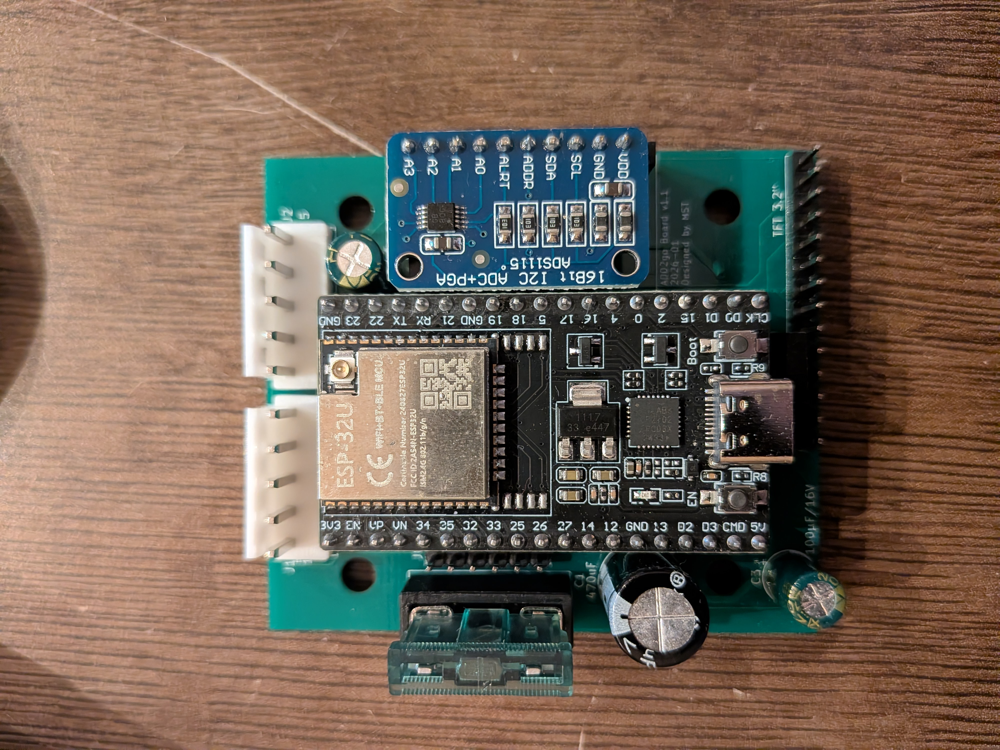
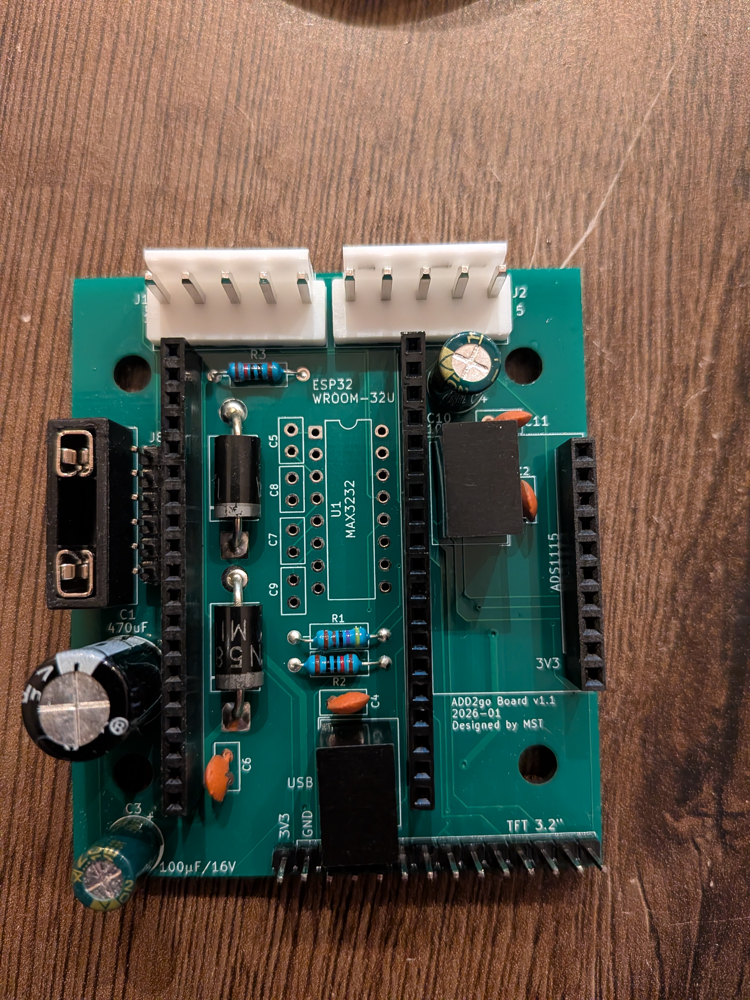
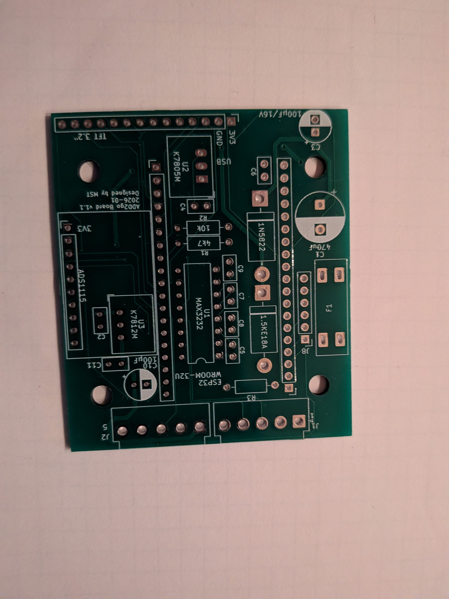
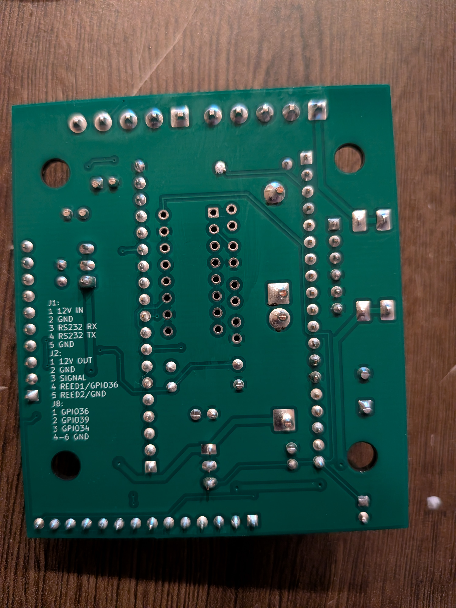

# ADD2go PCB

*Fertiges Empfänger-Modul auf Basis dieser Platine*

## Übersicht

Universelle Platine für ADD2go — kann je nach **Bestückung** entweder als
**Sender** (im Mischwagen, Anschluss an die ADD2-Waage über RS232) oder als
**Empfänger** (im Radlader, mit TFT-Display und Drucksensor für die
Schaufel-Wiegung) verwendet werden. Beide Varianten teilen das gleiche Board.

## Status

**Version 1** — bestellt bei JLCPCB, getestet, läuft produktiv.

## Features

- RS232-Pegelwandlung mit MAX3232 (Sender-Bestückung, für die ADD2-Waage)
- 12 V → 5 V Versorgung mit K7805M Schaltregler (für ESP32)
- 12 V stabilisiert mit K7812M (für Drucksensor in Empfänger-Bestückung)
- Verpolschutz mit 1N5822 Schottky-Diode
- TVS-Überspannungsschutz mit 1.5KE18A (18 V)
- Eingangs-Sicherung
- M16-Anschluss zur Waage (5-polig, WI-NET)
- Sockel für ESP32-WROOM-32U
- Header für TFT 3.2" Display (Empfänger-Bestückung)
- Header für ADS1115 ADC-Modul (Empfänger-Bestückung)
- Reine THT-Bestückung (Through-Hole), keine SMD-Bauteile

## Komponenten

*Bestückte Platine in Empfänger-Konfiguration*

| Bauteil | Typ | Funktion | Bestückt bei |
|---|---|---|---|
| ESP32-Sockel | Pin-Header 10 + 19 | Modulträger ESP32-WROOM-32U | Sender + Empfänger |
| MAX3232 | Interface-IC | RS232-Pegelwandler | nur Sender |
| K7805M-1000R3 | Mornsun Schaltregler | 12 V → 5 V (~95 % Wirkungsgrad) | Sender + Empfänger |
| K7812M-1000R3 | Mornsun Schaltregler | 12 V stabilisiert (für Drucksensor) | nur Empfänger |
| 1N5822 | Schottky-Diode | Verpolschutz Eingang | Sender + Empfänger |
| 1.5KE18A | TVS-Diode 18 V | Überspannungsschutz | Sender + Empfänger |
| Sicherung | Fuse | Eingangsschutz | Sender + Empfänger |
| Elkos | 100 µF / 16 V, 470 µF | Pufferkondensatoren Versorgung | Sender + Empfänger |
| Kerkos | 100 nF (mehrfach) | MAX3232-Ladekondensatoren + Stützkapazitäten | applikationsabhängig |
| 4k7, 10k | Widerstand | Pull-up / Pull-down | applikationsabhängig |

## Steckverbinder

| Header | Pinzahl | Funktion |
|---|---|---|
| WI-NET (M16) | 5-polig | Anschluss an die ADD2-Waage (Sender) bzw. Versorgung (Empfänger) |
| TFT | 14-polig | ILI9341 3.2" Display + Touch (nur Empfänger-Bestückung) |
| ADS1115 | 6-polig | I²C-Modul für Drucksensor (nur Empfänger-Bestückung) |
| ESP32 | 10 + 19 | Sockel für das ESP32-WROOM-32U-Modul |

> 📌 Pinbelegung des **WI-NET-Steckers** und alle **ESP32-Pin-Zuordnungen** stehen in der [Haupt-README](../README.md).

## Spannungsversorgung

- **Eingang**: 12 V vom WI-NET-Stecker (Bordnetz des Mischwagens / Radladers, real 11–14 V mit Schwankungen)
- Eingangsschutz: Sicherung → TVS (1.5KE18A, 18 V) → 1N5822 Schottky (Verpolschutz)
- **5 V Schiene** (für ESP32): K7805M Schaltregler — kein Kühlkörper nötig (~95 % Wirkungsgrad), weiter Eingangsspannungsbereich, robust gegen Bordnetz-Schwankungen
- **12 V Schiene stabilisiert** (nur Empfänger): K7812M für den XIDIBEI-Drucksensor (9–36 V Versorgungsbereich), liefert sauberere 12 V als das Bordnetz direkt

## Fertigung

| Parameter | Wert |
|---|---|
| Lagen | 2 (F.Cu / B.Cu) |
| Boardgröße | **59 × 68 mm** |
| Boardstärke | 1.6 mm (Standard) |
| Bestückung | reine THT (Through-Hole), manuell |
| Hersteller | bei JLCPCB bestellt |

| Vorderseite | Rückseite |
|---|---|
|  |  |

Gerber- und Drill-Files sind **nicht** im Repo enthalten — bei Bedarf in KiCad über *File → Plot* (Layer F.Cu, B.Cu, F.Mask, B.Mask, F.SilkS, B.SilkS, Edge.Cuts) und *File → Fabrication Outputs → Drill Files* exportieren.

## Dateien im Ordner

| Datei | Bedeutung |
|---|---|
| `add2go_pcb.kicad_pro` | KiCad-Projektdatei (Einstellungen, DRC-Regeln) |
| `add2go_pcb.kicad_sch` | Schaltplan (Eeschema) |
| `add2go_pcb.kicad_pcb` | PCB-Layout (Pcbnew) |

Projekt öffnen mit **KiCad 9.x** über `add2go_pcb.kicad_pro`.

> Hinweis: KiCad legt zusätzlich `*.kicad_prl`-Dateien an — die enthalten lokale User-Einstellungen (zuletzt geöffnete Tabs, Fenster-Layout) und sind über `.gitignore` ausgeschlossen.

## Querverweis

Für den Gesamtkontext (ESP32-Pinbelegung, RS232-Protokoll der ADD2-Waage,
Pinbelegung des WI-NET-Steckers, vollständige Komponentenliste des Projekts):
siehe [Haupt-README](../README.md).
